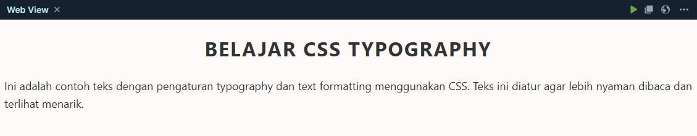

# Typography dan Text Formatting CSS

Typography adalah seni dan teknik mengatur teks agar terlihat rapi, nyaman dibaca, dan estetis. Dalam CSS, kita bisa mengatur berbagai aspek teks seperti font, ukuran, spasi, ketebalan, perataan, dan lainnya.

## 1. Mengatur Jenis Font (font-family)

Properti font-family digunakan untuk menentukan jenis huruf (font) yang digunakan.

```css
p {
  font-family: Arial, Helvetica, sans-serif;
}
```

Tips:

- Gunakan font fallback (seperti sans-serif, serif, monospace) untuk berjaga-jaga jika font utama tidak tersedia.

- Bisa juga menggunakan Google Fonts untuk font khusus, caranya dengan menambahkan link font ke head HTML dan menggunakan nama font di CSS. Contoh:

```html
<head>
  <link rel="stylesheet" href="https://fonts.googleapis.com/css?family=Roboto" />
  <style>
    p {
      font-family: "Roboto", sans-serif;
    }
  </style>
</head>
```

## 2. Mengatur Ukuran Font (font-size)

Ukuran font bisa diatur menggunakan satuan seperti px, em, rem, %, dll.

```css
h1 {
  font-size: 32px;
}

p {
  font-size: 1.2em;
}
```

## 3. Ketebalan Teks (font-weight)

Digunakan untuk mengatur ketebalan huruf.

```css
strong {
font-weight: bold; /_ atau gunakan angka: 100 - 900 _/
}
```

## 4. Gaya Font (font-style)

Untuk membuat teks menjadi italic atau normal.

```css
em {
  font-style: italic;
}
```

## 5. Transformasi Teks (text-transform)

Digunakan untuk mengubah huruf menjadi kapital, kecil, atau kapital di awal kata.

```css
.uppercase {
  text-transform: uppercase;
}

.lowercase {
  text-transform: lowercase;
}

.capitalize {
  text-transform: capitalize;
}
```

## 6. Dekorasi Teks (text-decoration)

Mengatur garis pada teks, seperti garis bawah, coret, atau tidak ada.

```css
a {
  text-decoration: none; /* menghilangkan garis bawah link */
}

.del {
  text-decoration: line-through;
}

.underline {
  text-decoration: underline;
}
```

## 7. Perataan Teks (text-align)

Untuk mengatur posisi teks: kiri, kanan, tengah, atau rata kiri-kanan.

```css
p {
  text-align: justify;
}

h2 {
  text-align: center;
}
```

## 8. Jarak Antar Huruf dan Baris

letter-spacing: Jarak antar huruf

```css
.rapat {
  letter-spacing: -1px;
}

.lebar {
  letter-spacing: 2px;
}
```

line-height: Jarak antar baris

```css
p {
  line-height: 1.6;
}
```

## 9. Warna Teks (color)

Untuk mengubah warna tulisan:

```css
h1 {
  color: #2c3e50;
}
```

## 10. Shorthand font

Untuk menyederhanakan semua properti font dalam satu baris:

```css
p {
  font:
    italic bold 16px/1.5 "Arial",
    sans-serif;
}
```

Formatnya:

```text
font: font-style font-weight font-size/line-height font-family;
```

## Contoh Penggunaan

```html
<style>
  body {
    font-family: "Segoe UI", sans-serif;
    color: #333;
    line-height: 1.6;
  }

  h1 {
    text-align: center;
    text-transform: uppercase;
    letter-spacing: 2px;
  }

  p {
    font-size: 18px;
    text-align: justify;
  }
</style>

<h1>Belajar CSS Typography</h1>
<p>
  Ini adalah contoh teks dengan pengaturan typography dan text formatting menggunakan CSS. Teks ini
  diatur agar lebih nyaman dibaca dan terlihat menarik.
</p>
```



> [!tip] Materi CSS Berikutnya!
>
> Lanjut ke [Basic Properti CSS](css-3.md)
