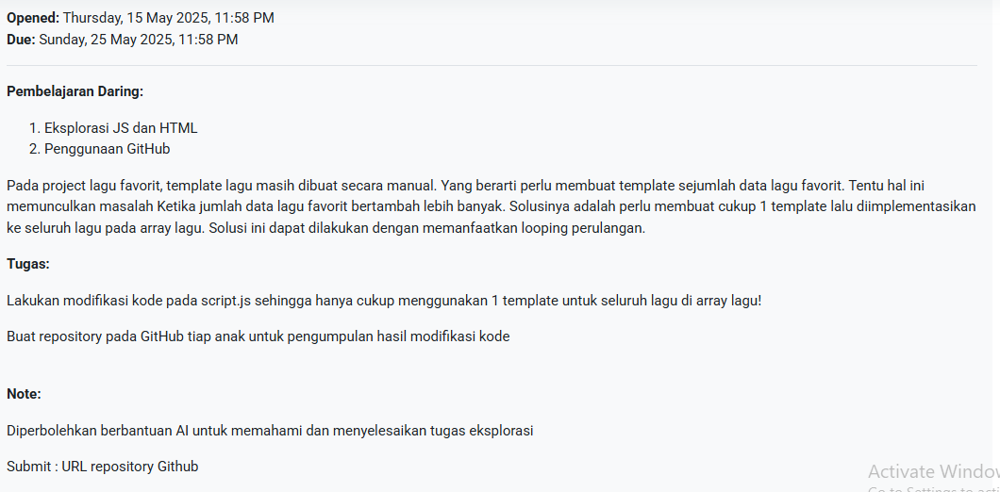

# Cara Mengerjakan Tugas Daspro: Array Musik ke Template HTML

Oke ini adalah tugas dari Pak Eka:


## Langkah 1: Menyiapkan HTML, CSS, dan JavaScript

- Siapkan file HTML yang berisi satu div khusus yang akan menjadi _entry point_ template.

```html
<!DOCTYPE html>
<html lang="en">
  <head>
    <meta charset="UTF-8" />
    <meta name="viewport" content="width=device-width, initial-scale=1.0" />
    <title>Document</title>
    <link rel="stylesheet" href="style.css" />
  </head>
  <body>
    <div id="app" class="container"></div>
  </body>
  <script src="main.js"></script>
</html>
```

- Setelah itu buat file `style.css` yang akan berisi style card musik kita.

> [!info] Card dalam web developer!
>
> Card pada dasarnya adalah sebuah elemen yang berisi informasi yang dapat dibagi menjadi beberapa bagian. Biasanya card digunakan untuk menampilkan informasi yang kompleks dalam sebuah tampilan yang lebih sederhana

- Dan buat file `main.js` yang akan berisi kode JavaScript untuk menampilkan data musik ke dalam card.

## Langkah 2: Membuat Array Musik

Buat array musik yang berformat seperti kemarin. Ada judul, penyanyi, like, view dan cover lagu.

```js
const lagu = [
  ["Blue", "Yun Kai", 389, 10900, "blue.png"],
  ["Play", "Alan Walker", 7078, 140800, "play.png"],
  ["Sampai Akhir Waktu", "Yovie Nuno", 990, 12800, "sampai.png"],
  ["Bring Me To Life", "Evanescence", 1000, 16000, "bring.png"],
  ["Patience", "Take That", 1000, 16000, "cause.png"],
]
```

## Langkah 3: Membuat Template Card Musik dan Styling

Buat template card musik dengan elemen html, namun untuk sekarang gapelu di kasih isi.

```html
<div class="" style="/*background-image: url(${gambar});*/ border-radius: 16px;">
  <div class="card">
    <h3 class="music-title" id="music-title-1"></h3>
    <br />
    <p class="music-author" id="music-author-1"></p>
    
    <div class="footer-card">
      <div class="">
        <i class="ph ph-heart"></i>
        <p class="likes" id="likes-1"></p>
      </div>
      <div class="">
        <i class="ph ph-play"></i>
        <p class="play" id="play-1"></p>
      </div>
    </div>
  </div>
</div>
```

Sekalian dikasi css biar bagus (nanti di akhir ada full kode saya)


## Langkah 4: Membuat Kode Perulangan untuk Menampilkan Setiap Data Musik

Perulangan dimulai dari 0, dan akan berhenti ketika index array lagu lebih besar dari panjang array lagu. Setelah itu buat variabel yang dimuat ke card. Contohnya judul berisi `lagu[i][0]`, maksudnya judul akan berganti index dari lagu pertama ke kedua dan seterusnya. Begitu juga dengan yang lain.

```js
for (let i = 0; i < lagu.length; i++) {
  let judul = lagu[i][0]
  let penyanyi = lagu[i][1]
  let like = lagu[i][2]
  let view = lagu[i][3]
  let gambar = lagu[i][4]
}
```

## Langkah 5: Menggabungkan Kode Perulangan dengan Template Card Musik

Template yang sudah kita buat bisa dimasukan ke variabel baru lalu kita panggil ke HTML. udah lupa? begini caranya

```js
const konten = document.getElementById("app")

for (let i = 0; i < lagu.length; i++) {
  let judul = lagu[i][0]
  let penyanyi = lagu[i][1]
  let like = lagu[i][2]
  let view = lagu[i][3]
  let gambar = lagu[i][4]

  let template = `
    <div class="" style="background-image: url(${gambar}); border-radius: 16px;">
            <div class="card" >
                <h3 class="music-title" id="music-title">${judul}</h3>
                <br><p class="music-author" id="music-author">${penyanyi}</p>
                
                <div class="footer-card">
                    <div class=""><i class="ph ph-heart"></i><p class="likes" id="likes">${like}</p></div>
                    <div class=""><i class="ph ph-play"></i><p class="play" id="play">${view}</p></div>
                </div>
            </div>
        </div>
  `

  konten.innerHTML += template
}
```

kita breakdown satu-satu:

- `const konten = document.getElementById("app")` ini adalah cara kita mengambil id dari element HTML yang kita buat sebelumnya.

  > [!warning] Hati-hati!
  >
  > Ingat, nama dari ID harus sesuai dengan nama yang kita buat di HTML.s

- `let template = ` ini adalah cara kita membuat template card musik yang akan kita panggil ke HTML. template ini akan berubah-ubah sesuai dengan index array lagu yang ada.

- Isikan setiap elemen h3 atau p didalam card dengan variabel yang sudah kita buat, dengan `${nama-variabel}`. Contohnya,`judul` akan mengisi h3 maka menjadi `<h3 class="music-title" id="music-title">${judul}</h3>`

- `konten.innerHTML += template` ini adalah cara kita menambahkan template card musik ke HTML. Jika tidak ada `+=` maka template card musik akan menggantikan konten yang ada di HTML.

## Langkah 6: Upload ke Github

Okeh langkah terakhir tinggal upload ke Github. **APA KALIAN GAPUNYA GITHUB?** Jirlah SIJA ga punya github 😂. Kalo belum buat akun silahkan buat akun di[Github.com](https://github.com/signup). Setelah itu Login dengan akun yang sudah kalian buat. Lalu buat repository baru dengan nama yang kalian inginkan. Setelah itu upload semua file yang sudah kalian buat. Kalo udah ya kirim ke [LMS](https://lms.stembayo.top/mod/assign/view.php?id=709)

jangan lupa follow [Github saya](https://github.com/byntangxyz)

## Full Source Code Buatan Saya

```html
<!DOCTYPE html>
<html lang="en">
  <head>
    <meta charset="UTF-8" />
    <meta name="viewport" content="width=device-width, initial-scale=1.0" />
    <title>Document</title>
    <link rel="stylesheet" href="style.css" />
    <link
      rel="stylesheet"
      type="text/css"
      href="https://cdn.jsdelivr.net/npm/@phosphor-icons/web@2.1.1/src/regular/style.css"
    />
    <link
      rel="stylesheet"
      type="text/css"
      href="https://cdn.jsdelivr.net/npm/@phosphor-icons/web@2.1.1/src/fill/style.css"
    />
  </head>
  <body>
    <div id="app" class="container"></div>
  </body>
  <script src="main.js"></script>
</html>
```

```css
* {
  margin: 0;
  box-sizing: border-box;
  font-family: sans-serif;
}
.container {
  display: flex;
  justify-content: space-around;
  align-items: center;
  margin: 2rem 1rem;
  gap: 1rem;
  flex-wrap: wrap;
}
.card {
  background-color: rgba(255, 255, 255, 0.2);
  padding: 2rem;
  border-radius: 16px;
  -webkit-backdrop-filter: blur(5px);
  backdrop-filter: blur(5px);
  background-repeat: no-repeat;
}
.card img {
  width: 20rem;
  animation-name: spin;
  animation-duration: 5000ms;
  animation-iteration-count: infinite;
  animation-timing-function: linear;
}

.music-title,
.music-author,
.likes,
.play,
.ph {
  animation: Color 4s linear infinite;
  -webkit-animation: Color 4s ease-in-out infinite;
}

.footer-card {
  display: flex;
  justify-content: space-between;
}
.footer-card div {
  display: flex;
}

@keyframes spin {
  from {
    transform: rotate(0deg);
  }
  to {
    transform: rotate(360deg);
  }
}

@keyframes Color {
  0% {
    color: #a0d468;
  }

  20% {
    color: #4fc1e9;
  }

  40% {
    color: #ffce54;
  }

  60% {
    color: #fc6e51;
  }

  80% {
    color: #ed5565;
  }

  100% {
    color: #ac92ec;
  }
}

@-moz-keyframes Color {
  0% {
    color: #a0d468;
  }

  20% {
    color: #4fc1e9;
  }

  40% {
    color: #ffce54;
  }

  60% {
    color: #fc6e51;
  }

  80% {
    color: #ed5565;
  }

  100% {
    color: #ac92ec;
  }
}

@-webkit-keyframes Color {
  0% {
    color: #a0d468;
  }

  20% {
    color: #4fc1e9;
  }

  40% {
    color: #ffce54;
  }

  60% {
    color: #fc6e51;
  }

  80% {
    color: #ed5565;
  }

  100% {
    color: #ac92ec;
  }
}
```

```js
const lagu = [
  ["Blue", "Yun Kai", 389, 10900, "blue.png"],
  ["Play", "Alan Walker", 7078, 140800, "play.png"],
  ["Sampai Akhir Waktu", "Yovie Nuno", 990, 12800, "sampai.png"],
  ["Bring Me To Life", "Evanescence", 1000, 16000, "bring.png"],
  ["Patience", "Take That", 1000, 16000, "cause.png"],
];

const konten = document.getElementById("app");

for (let i = 0; i < lagu.length; i++) {
  var judul = lagu[i][0];
  var penyanyi = lagu[i][1];
  var like = lagu[i][2];
  var view = lagu[i][3];
  var gambar = lagu[i][4];

  var template = `
    <div class="" style="background-image: url(${gambar}); border-radius: 16px;">
            <div class="card" >
                <h3 class="music-title" id="music-title-1">${judul}</h3>
                <br><p class="music-author" id="music-author-1">${penyanyi}</p>
                
                <div class="footer-card">
                    <div class=""><i class="ph ph-heart"></i><p class="likes" id="likes-1">${like}</p></div>
                    <div class=""><i class="ph ph-play"></i><p class="play" id="play-1">${view}</p></div>
                </div>
            </div>
        </div>
  `;

  konten.innerHTML += template;
}
```
