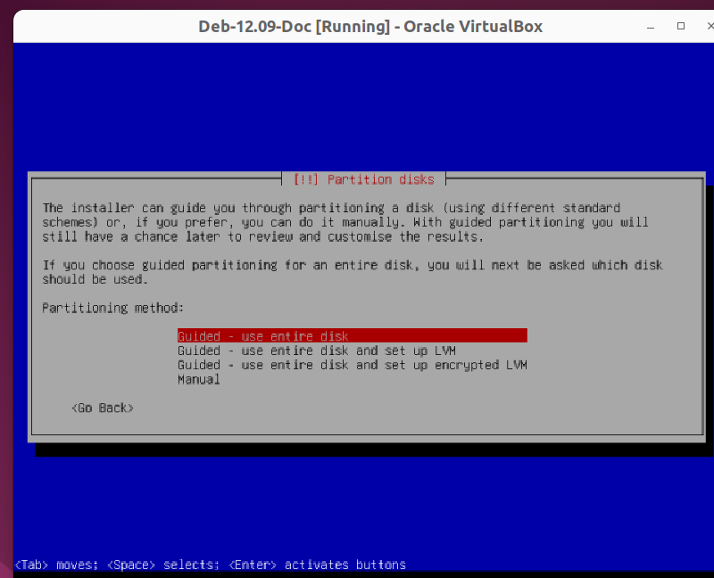
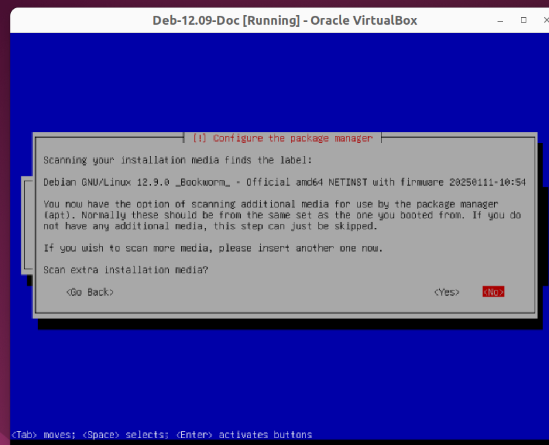

1.  


2.  


3.  


4.  


5.  


6.  


7.  


8.  


9.  


10.  


11.  


12.  


13.  


14.  


15.  


16.  


17.  


18.  


19.  


20.  


21.  


22.  


23.  


24.  


25.  Aktifkan SSH dengan command ```nano /etc/ssh/sshd_config```


26.  "Active" menandakan ssh sudah dapat dilakukan dengan ```ssh user@ip-address```


27.  Cari repositori terdekat dan ubah dengan link repo yang tersedia : saya menggunakan repo SMKN 2 Depok

```
    deb http://repo.stembayo.sch.id/debian/ bookworm main non-free-firmware                 
    deb-src http://repo.stembayo.sch.id/debian/ bookworm main non-free-firmware
    deb http://repo.stembayo.sch.id/debian-security bookworm-security main non-free-firmware
    deb-src http://repo.stembayo.sch.id/debian-security bookworm-security main non-free-firmware
    deb http://repo.stembayo.sch.id/debian bookworm-updates main non-free-firmware
    deb-src http://repo.stembayo.sch.id/debian bookworm-updates main non-free-firmware
```
28. Setelah mengganti, jangan lupa ```apt update```


