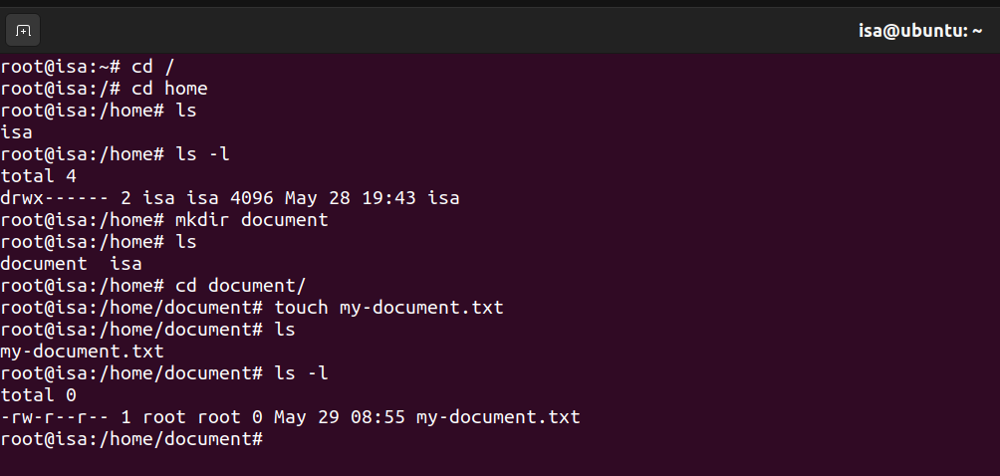
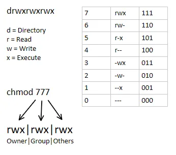
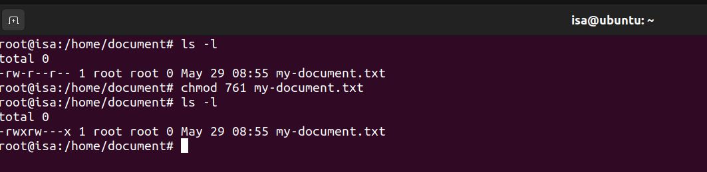
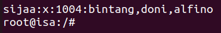
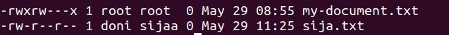
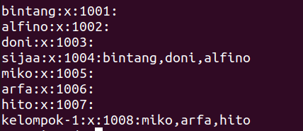
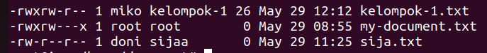
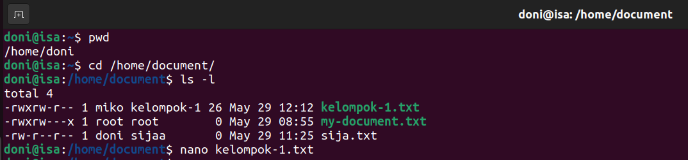
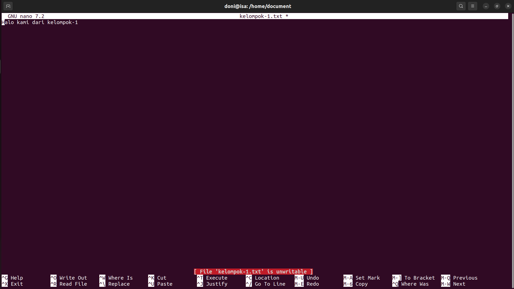

# **Command Dasar**

**📁 Navigasi File dan Direktori**

| Perintah         | Fungsi                                                   |
| ---------------- | -------------------------------------------------------- |
| `pwd`            | Menampilkan path direktori saat ini                      |
| `ls`             | Menampilkan daftar file dan folder di direktori saat ini |
| `ls -l`          | Menampilkan daftar file dan folder secara detail         |
| `cd nama_folder` | Masuk ke direktori tertentu                              |
| `cd ..`          | Kembali ke direktori sebelumnya                          |
| `cd /`           | Masuk ke root direktori                                  |
| `cd ~`           | Masuk ke direktori home pengguna                         |

**📂 Manipulasi File dan Folder**

| Perintah                | Fungsi                                      |
| ----------------------- | ------------------------------------------- |
| `touch nama_file`       | Membuat file kosong baru                    |
| `mkdir nama_folder`     | Membuat direktori baru                      |
| `rm nama_file`          | Menghapus file                              |
| `rm -r nama_folder`     | Menghapus folder beserta isinya             |
| `cp file1 file2`        | Menyalin file                               |
| `cp -r folder1 folder2` | Menyalin folder                             |
| `mv file1 file2`        | Memindahkan atau mengganti nama file/folder |

**📄 Melihat Isi File**

| Perintah         | Fungsi                                                 |
| ---------------- | ------------------------------------------------------ |
| `cat nama_file`  | Menampilkan isi file                                   |
| `more nama_file` | Menampilkan isi file halaman per halaman               |
| `less nama_file` | Menampilkan isi file dengan navigasi ke atas dan bawah |
| `head nama_file` | Menampilkan 10 baris pertama file                      |
| `tail nama_file` | Menampilkan 10 baris terakhir file                     |

**🔍 Pencarian**

| Perintah                     | Fungsi                                                         |
| ---------------------------- | -------------------------------------------------------------- |
| `find /path -name nama_file` | Mencari file berdasarkan nama                                  |
| `grep "teks" nama_file`      | Mencari teks dalam file                                        |
| `locate nama_file`           | Menemukan file dengan cepat (butuh `updatedb` terlebih dahulu) |


**🛠️ Sistem dan Informasi**

| Perintah   | Fungsi                                  |
| ---------- | --------------------------------------- |
| `clear`    | Membersihkan layar terminal             |
| `history`  | Menampilkan riwayat perintah            |
| `df -h`    | Menampilkan penggunaan disk             |
| `free -h`  | Menampilkan penggunaan memori (RAM)     |
| `top`      | Menampilkan proses yang sedang berjalan |
| `uname -a` | Menampilkan informasi sistem            |
| `whoami`   | Menampilkan nama user saat ini          |


**📦 Manajemen Paket (Debian/Ubuntu)**

| Perintah                      | Fungsi                            |
| ----------------------------- | --------------------------------- |
| `sudo apt update`             | Memperbarui daftar paket          |
| `sudo apt upgrade`            | Memperbarui semua paket terinstal |
| `sudo apt install nama_paket` | Menginstal paket                  |
| `sudo apt remove nama_paket`  | Menghapus paket                   |


# **Permission**

*Permission* dalam Linux adalah sistem perizinan yang mengatur siapa yang bisa membaca, menulis, atau mengeksekusi file dan direktori. Ini sangat penting untuk menjaga keamanan dan kontrol akses terhadap data di sistem Linux.

👤 Konsep Dasar Permission

1. **Jenis User**

| Jenis          | Penjelasan                                     |
| -------------- | ---------------------------------------------- |
| **Owner (u)**  | Pemilik file (biasanya user yang membuat file) |
| **Group (g)**  | Grup yang memiliki akses ke file               |
| **Others (o)** | Semua user lain di sistem                      |

2. **Jenis Permission**

| Huruf | Nama    | Fungsi                                                               |
| ----- | ------- | -------------------------------------------------------------------- |
| **r** | read    | Membaca isi file atau melihat isi direktori                          |
| **w** | write   | Mengubah isi file atau menambah/hapus isi direktori                  |
| **x** | execute | Menjalankan file (kalau itu program/script), atau masuk ke direktori |

Contoh output



**Penjelasan**:

-rwxr-xr-- = permission

( - ) : file biasa (d jika direktori)

 - rwx : hak akses owner → read, write, execute
 - r-x : hak akses group → read, execute
 - r-- : hak akses others → read only


**🔧 Mengubah Permission**
1. chmod (change mode)
    - Digunakan untuk mengatur permission.
- Dengan simbol (r, w, x):
```
    chmod u+x file.sh   # Menambahkan execute untuk owner

    chmod g-w file.txt  # Menghapus write untuk group

    chmod o+r file.txt  # Menambahkan read untuk others 
```

- Dengan Oktal


- Contoh

    


👤 Mengubah Kepemilikan File

- chown = mengubah owner atau group

    ```
    chown user:group file.txt
    ```


# **User Management**

### 1. Menambahkan user

```
    adduser nama_user
```
### 2. Menghapus User

```
    deluser nama_user
```

### 3. Mengubah Password User

```
sudo passwd nama_user
```

### 4. Mengetahui Banyak User

```
cat /etc/passwd
```

# **Group Management**

### 1. Menambahkan Group

```
sudo addgroup nama_group
```

### 2. Mernghapus Group 

```
sudo delgroup nama_group
```

### 3. Mengetahui Banyak Group dan Anggotanya

```
cat /etc/group
```

## Tugas 1

- **Buat 3 User**
- **Buat Group untuk ketiga user tersebut**
- **Pindahkan mereka ke dalam group**

### Hasil



## Tugas 2

- **Membuat file**
- **Ubah kepemilikan menjadi nama_user dan nama_group yang telah dibuat**

### Hasil



## Tugas 3

- **Buat group untuk 3 orang**
- **Lalu tambahkan ke group yang sudah dibuat**
- **Buat 1 file yang hanya bisa read, write, execute oleh anggota group dan owner**
- **Orang lain hanya bisa melihat file tersebut**

### Hasil 





### Coba login ke user yang berada di group sijaa 



### Hasil

