## Selamat datang pada materi "Bagaimana menginstall dhcp-server?"

### Pastikan kamu fokus dan teliti pada langkah-langkah di bawah ini!

1. **Membuat setidaknya dua interface (Bridge Adapter & Internal Network)**
    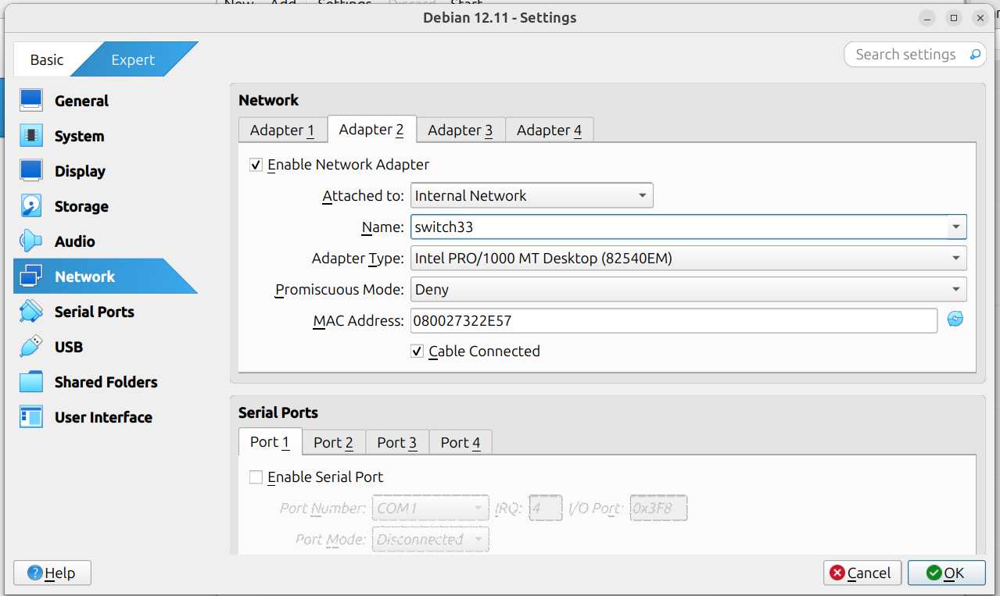

2. **Menginstall OS Trisequel (client) dan mengubah interfacenya menjadi Internal Network**
   Teman-teman bebas memilih OS yang akan digunakan
   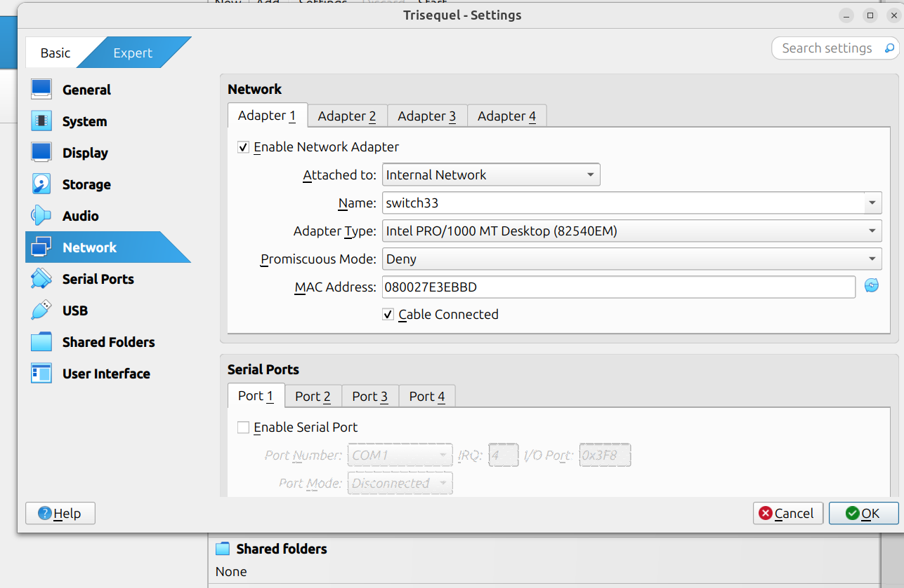

    Pastikan **nama interface yang diberikan sama** dengan di debian

3. **Lakukan pengecekan IP Address**  
   
    ```ip address``` pada terminal

    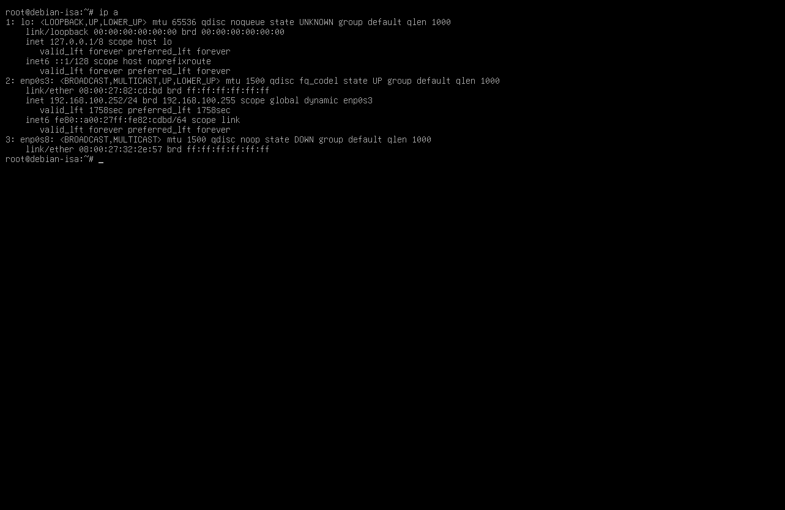

    note: jika tidak bisa terlihat dengan jelas dapat di-zoom •ᴗ•
4. **Konfigurasi network pada Debian Server**

    ```nano /etc/network/interface```

    tambahkan IP Address pada interface kedua **enp0s8** (nama interface ini dapat berbeda-beda)
    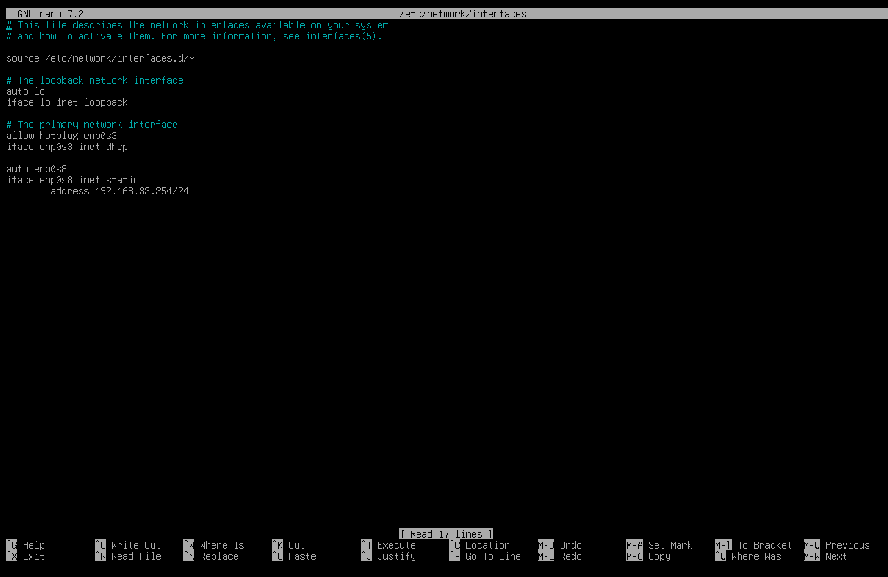

5. **Lakukan pengecekan IP Kembali**
   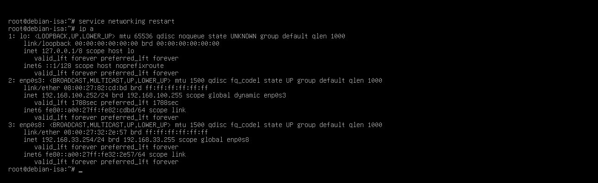

   kalian dapat melihat bahwa ada dua IP Address, yakni dari interface pertama (enp0s3) dan kedua (enp0s8)

6. **Lakukan PING**

   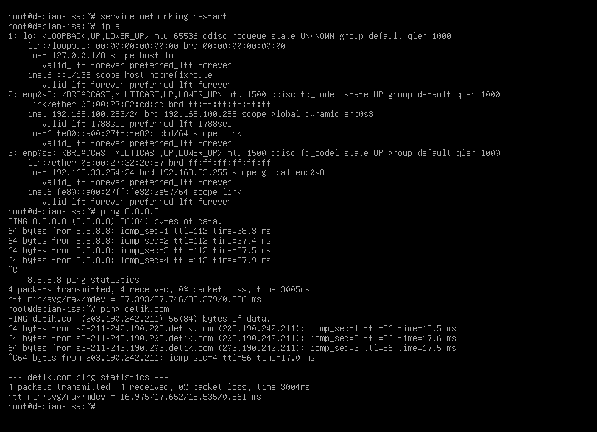


7. **Lakukan _apt update_ dan _apt -y install isc-dhcp-server_**
    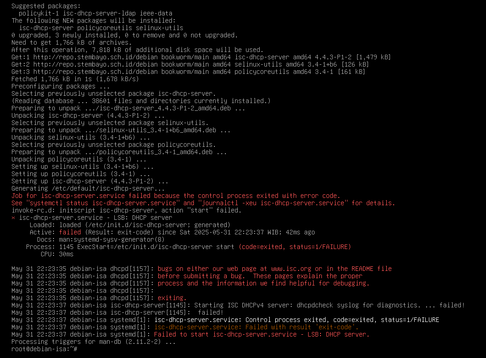

8. **Lakukan backup konfigurasi** 
   
   ```cd /etc/dhcp```

   ```cp dhcp.conf dhcp.conf.backup```

   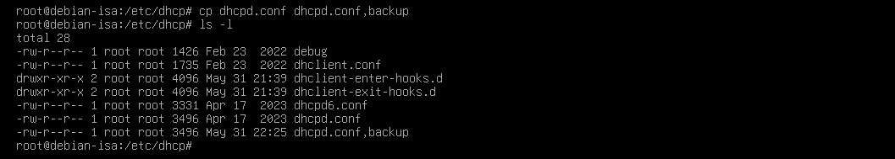

9. **Lakukan Konfigurasi dan hapus semua baris kecuali "a slightly"**
    
    Dari

     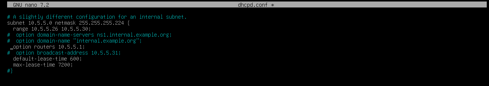

    Menjadi

    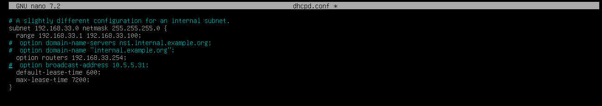

    pada gambar diatas ini, kalian harus memahami konfigurasi subnet, netmask, range, option-routers (gateway).

    Penjelasan: 
    - Subnet : kalian dapat menentukan berapa subnet IP yang akan digunakan untuk trisequel
    - Netmask : kalian dapat memilih diantara /8, /16, /24
    - Range : di sini kalian dapat menentukan berapa banyak IP Address yang dapat digunakan oleh Trisequel
    - Option-routers: Merupakan gateway atau akses internet yang akan didapat dari debian (langkah ke 4 IP Add pada "enp0s8")

10. **Mengubah default interface yang akan digunakan untuk DHCP Server**
    
    ```cd ..```

    ```cd /default```

    Ubah InterfacesV4 = "enp0s8"

    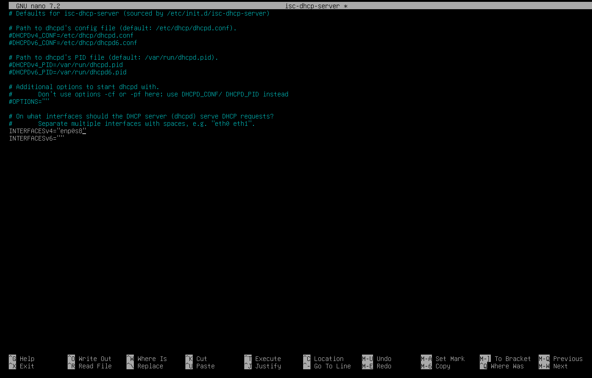

11. **Aktifkan isc-dhcp-service**

    ```service isc-dhcp-service start```

    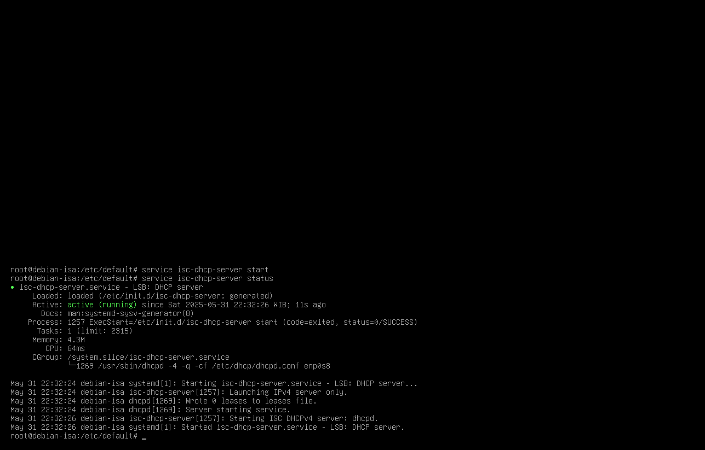

12. **Lakukan Pengecekan IP Address pada Trisequel**
    
    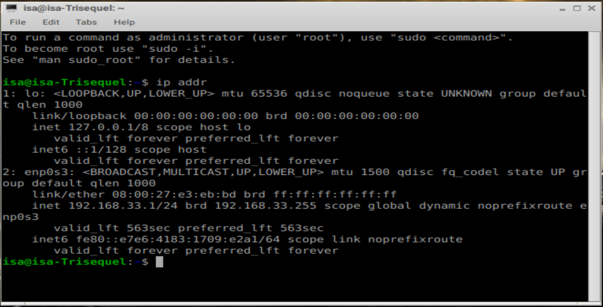


>
>[!tip] Materi Berikutnya!
>
>Lanjut ke [Mikrotik](mikrotik-1.md)
