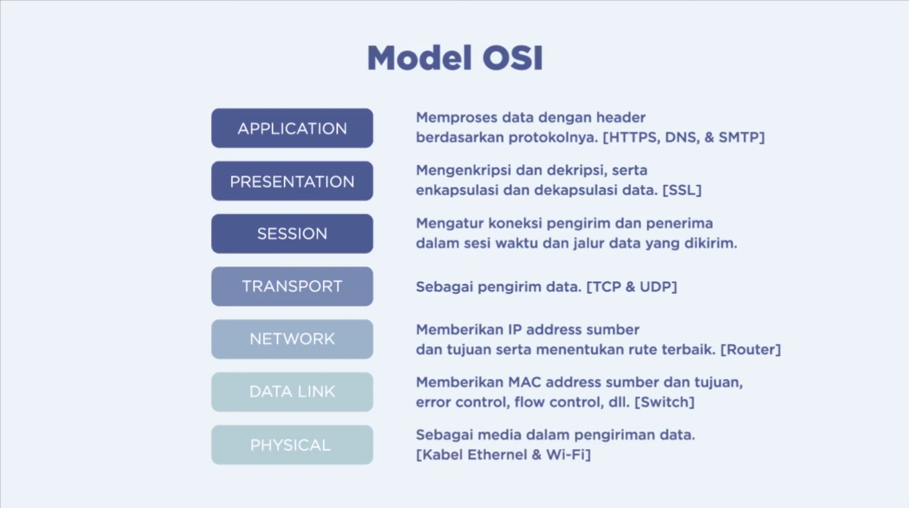
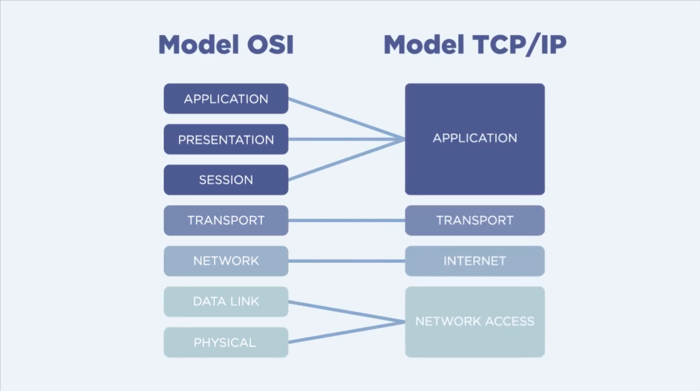

## Apa itu OSI Layer

<iframe width="750" height="350" 
  src="https://www.youtube.com/embed/UJn-fbxWbGs" 
  title="OSI Layers" 
  frameborder="0" 
  allow="accelerometer; autoplay; clipboard-write; encrypted-media; gyroscope; picture-in-picture" 
  allowfullscreen>
</iframe>

>Setelah melihat video tersebut kamu bisa membayangkan bagaimana alurnya
>

>
1. ### Application
    Memproses data dengan header berdasarkan protokolnya.
    [HTTPS, DNS, & SMTP]
2. ### Presentation
    Mengenkripsi dan dekripsi, serta enkapsulasi dan dekapsulasi data.
    [SSL]

3. ### Session
    Mengatur koneksi pengirim dan penerima dalam sesi waktu dan jalur data yang dikirim.

4. ### Transport
    Sebagai pengirim data.
    [TCP & UDP]

5. ### Network
    Memberikan IP address sumber dan tujuan serta menentukan rute terbaik.
    [Router]

6. ### Data Link
    Memberikan MAC address sumber dan tujuan, error control, flow control, dll.
    [Switch]

7. ### Physical
    Sebagai media dalam pengiriman data.
    [Kabel Ethernet & Wi-Fi]
>
### Cara Kerja model OSI :
1. Informasi berawal dari layer Application. Informasi kemudian melewati layer presentation dan layer session. Pada tahap ini biasanya belum dilakukan transformasi data. Informasi yang melalui ketiga layer ini disebut PDU (Protocol Data Unit) atau data saja.
2. Setelah sampai di layer **Transport**, data akan mengalami transformasi ke bentuk lain yang disebut **segmen**.
3. Segmen mengalir ke layer **network** dan kemudian diubah menjadi **packet**.
4. Packet mengalir ke layer **data link** dan kemudian diubah menjadi **frame**.
5. Terakhir, frame mengalir ke layer **physical** dan kemudian diubah menjadi bits atau **bit-bit**.
    Pada layer ini, bit-bit diubah menjadi besaran fisik, seperti arus listrik, gelombang elektromagnetik, dan sebagainya.
>
> Lalu apa bedanya dengan TCP/IP? (╥﹏╥)
>

| Aspek               | OSI Model                                                                             | TCP/IP Model                                                            |
| ------------------- | ------------------------------------------------------------------------------------- | ----------------------------------------------------------------------- |
| **Jumlah Layer**    | 7 layer (Physical, Data Link, Network, Transport, Session, Presentation, Application) | 4 layer (Network Interface, Internet, Transport, Application)           |
| **Asal**            | Dikembangkan sebagai standar teori oleh ISO                                           | Dikembangkan berdasarkan protokol internet (TCP/IP) yang sudah berjalan |
| **Struktur**        | Lebih detail, terpisah dengan jelas tiap fungsi                                       | Lebih praktis dan ringkas, gabungkan beberapa fungsi                    |
| **Layer Layer**     | Layer Session dan Presentation terpisah                                               | Layer Session dan Presentation digabung ke Application Layer            |
| **Penggunaan**      | Lebih sebagai model teori dan pengajaran                                              | Digunakan langsung di internet dan jaringan komputer nyata              |
| **Contoh protokol** | Teori umum, tanpa protokol spesifik                                                   | TCP, IP, UDP, HTTP, FTP, DNS, dll                                       |
>
>Lalu bagaimana dengan lapisan data yang dikirim?

>
| Aspek                     | Penjelasan Sederhana                                                                            |
| ------------------------- | ----------------------------------------------------------------------------------------------- |
| **Nama Data**             | **Frame**                                                                                       |
| **Apa itu Frame?**        | Potongan data yang sudah ditambah info seperti alamat pengirim, penerima, dan cek kesalahan     |
| **Dari Layer Sebelumnya** | Menerima **Packet** dari Network Layer (Layer 3)                                                |
| **Ke Layer Berikutnya**   | Mengirim **bit-bit** ke Physical Layer (Layer 1)                                                |
| **Yang Ditambahkan**      | - MAC Address pengirim dan penerima - Informasi kontrol - Kode pengecekan kesalahan (CRC) |
| **Yang Diterima**         | Frame dari perangkat lain → dicek → diubah kembali ke packet                                    |
| **Jika Ada Kesalahan**    | Frame dibuang atau minta dikirim ulang                                                          |

>
### Ilustrasi Sederhana:
Bayangkan kamu mengirim paket lewat kurir:
- Data (packet) = isi paket (pesan yang ingin dikirim)
- Frame = kotak pengiriman yang diberi:
    - Nama pengirim
    - Nama penerima
- Barcode untuk dicek apakah rusak atau tidak
- Kurir (Physical Layer) hanya kirim kotaknya (bit-bit). Tapi di dalamnya, semua informasi penting sudah dibungkus oleh
    Data Link Layer.