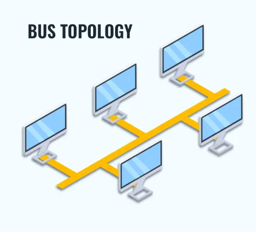
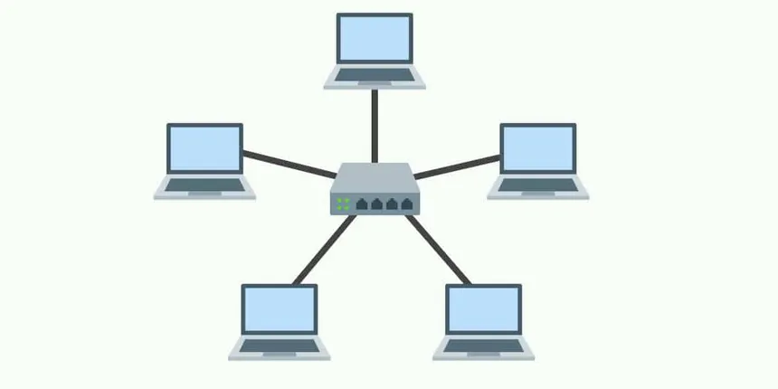
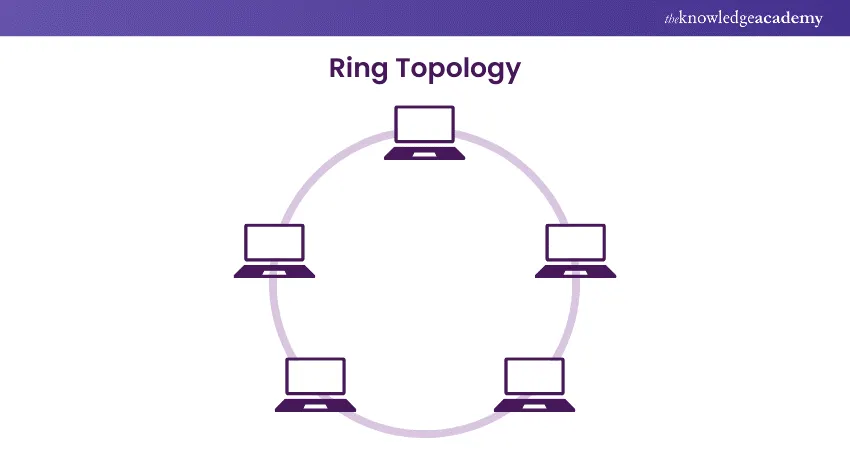
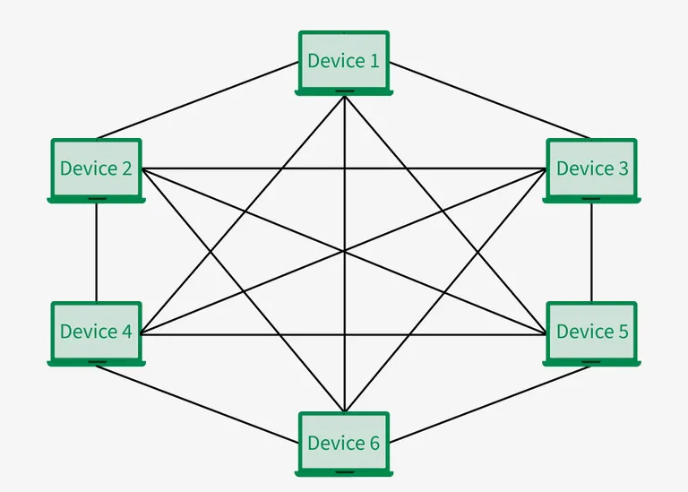
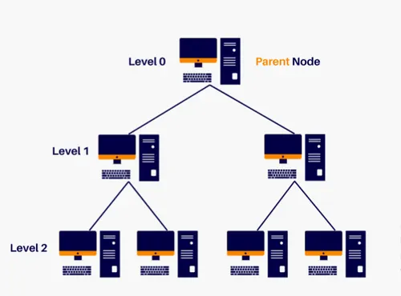
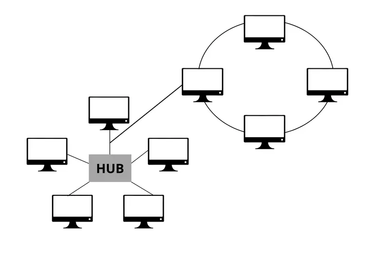

## Sudah kenal apa itu Jaringan Komputer?
### Ternyata Jaringan Komputer ada jenisnya
>Kali ini kita akan menyelam lebih dalam
>
#### LAN (Local Area Network)
Jaringan yang mencakup area kecil seperti rumah atau kantor.
#### MAN (Metropolitan Area Network)
Jaringan yang mencakup area perkotaan
#### WAN (Wide Area Network)
Jaringan yang mencakup area yang lebih luas seperti antar negara dan benua.
>
>
### Tentu pada Jaringan Komputer ini ada alatnya!
>Kira-kira apa saja ya?
>
1.	**Router**	
    - Menghubungkan dua atau lebih jaringan dan meneruskan data antar jaringan
2.	**Switch**
    - Menghubungkan banyak perangkat dalam jaringan lokal (LAN)
3.	**Hub**	
    - Seperti switch, tapi kurang efisien karena tidak memfilter data
4.	**Modem**
    - Mengubah sinyal digital ke analog dan sebaliknya (akses internet)
5.	**Access Point**
    - Menghubungkan perangkat ke jaringan Wi-Fi
6.	**Repeater**
    - Memperkuat sinyal jaringan yang lemah
7.	**Bridge**	
    - Menghubungkan dua jaringan LAN
8.	**Firewall (fisik)**	
    - Mengontrol lalu lintas jaringan dan melindungi dari serangan
9.	**Kartu Jaringan (NIC)**	
    - Perangkat yang memungkinkan komputer terhubung ke jaringan
10.	**Server**	
    - Menyediakan layanan atau sumber daya untuk perangkat lain
>
## Emang bisa kalau alatnya doang? Pasti ada perantaranya!
>Ada banyak nih jenisnya
>
#### Wired Connections
>
1. **Kabel UTP**
    - (Unshielded Twisted Pair) Digunakan pada LAN, umum untuk kabel Ethernet
2. **Kabel STP**
    - (Shielded Twisted Pair) Sama seperti UTP, tapi dilapisi pelindung dari interferensi
3. **Kabel Coaxial**
    - Dulu umum untuk TV dan jaringan lama
4. **Kabel Fiber Optik**
    - Menggunakan cahaya, sangat cepat, tahan gangguan, cocok untuk jarak jauh
>
#### Wireless Connection
1. **Wi-Fi (WLAN)** 
    - Koneksi tanpa kabel, menggunakan gelombang radio
2. **Bluetooth**
    - Komunikasi jarak pendek antar perangkat
3. **Infrared**
    - Digunakan pada perangkat seperti remote atau printer
4. **Gelombang Mikro**	
    - Digunakan dalam jaringan area luas (WAN) dan komunikasi satelit
>
#### Phychical Connection
1. **RJ-45** 
    - Konektor kabel UTP untuk sambungan ke switch, router, atau PC
2. **Port LAN**	
    - Port yang menerima konektor RJ-45 pada perangkat
3. **Antena**
    - Untuk mengirim dan menerima sinyal nirkabel (pada router/AP)
## Udah kenal alatnya belum nih? Selanjutnya kita membahas topologi!
1.	**Bus**	
    - Semua perangkat terhubung ke satu kabel utama (backbone)
    - Hemat kabel dan Struktur sederhana
    - Jika kabel utama putus, seluruh jaringan gagal
    
>
2.	**Star**	
    - Semua perangkat terhubung ke satu perangkat pusat (switch/hub)	
    - Mudah dikembangkan dan _maintenance_
    - Jika switch rusak, seluruh jaringan tidak berfungsi
    
>
3.	**Ring**	
    - Perangkat terhubung membentuk lingkaran	- Performa stabil
    - Data mengalir teratur	
    - Jika satu node gagal, seluruh jaringan bisa terganggu
    
>
4.	**Mesh**	
    - Setiap perangkat terhubung langsung ke semua perangkat lainnya	
    - Sangat andal
    - Koneksi cadangan banyak	
    - Mahal dan rumit dalam pemasangan
    
>
5.	**Tree**	
    - Kombinasi dari topologi star dalam struktur bertingkat	
    - Cocok untuk jaringan besar
    - Mudah dikembangkan	
    - Titik pusat jadi titik lemah bila rusak
    
    
>
6.	**Hybrid**	
    - Gabungan dua atau lebih jenis topologi	
    - Fleksibel sesuai kebutuhan jaringan	
    - Instalasi dan konfigurasi lebih kompleks
    
