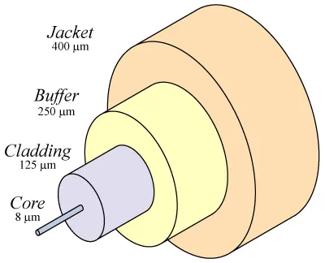

### Pada halaman ini kita akan membahas media dan istilah yang sering muncul
>
1. #### Copper Cabling
- Kabel tembaga digunakan secara luas dalam jaringan karena biaya yang rendah dan kemudahan instalasi.
- Jenis-jenis kabel tembaga meliputi Unshielded Twisted Pair (UTP), Shielded Twisted Pair (STP), dan Coaxial.
- Kabel tembaga rentan terhadap gangguan elektromagnetik (EMI) dan interferensi frekuensi radio (RFI).
- Penting untuk memperhatikan keselamatan saat menangani kabel tembaga karena risiko kebakaran dan bahaya listrik.
- Berikut adalah gambar STP dan Coaxial  
 
>
2. #### UTP Cabling
- UTP (Unshielded Twisted Pair) adalah jenis kabel tembaga yang paling umum digunakan dalam jaringan Ethernet.
- UTP terdiri dari pasangan kawat yang dipilin untuk mengurangi interferensi.
- Standar UTP mencakup kategori seperti Cat5, Cat5e, Cat6, dan Cat6a, yang menentukan kecepatan dan frekuensi transmisi.
- Jenis kabel UTP meliputi:
    - Straight-through: menghubungkan perangkat berbeda (misalnya, PC ke switch).
    - Crossover: menghubungkan perangkat sejenis (misalnya, switch ke switch).
- Penting untuk mengetahui pinout dan menggunakan alat tester kabel untuk memastikan koneksi yang benar.
- Berikut gambar kabel UTP  

>
3. #### Fiber Optic Cabling
- Kabel serat optik mentransmisikan data sebagai pulsa cahaya melalui serat kaca atau plastik.
- Keunggulan utama:
    - Jarak transmisi yang lebih jauh dibandingkan kabel tembaga.
    - Imunitas terhadap EMI dan RFI, sehingga cocok untuk lingkungan dengan banyak gangguan elektromagnetik.
    - Kapasitas bandwidth yang tinggi, memungkinkan kecepatan data yang lebih besar.
    - Jenis serat optik:
        - Single-mode: digunakan untuk jarak jauh dengan satu jalur cahaya.
        - Multimode: digunakan untuk jarak pendek dengan beberapa jalur cahaya.
        - Konektor umum: LC, SC, ST.
    - Pengujian kabel serat optik memerlukan peralatan khusus seperti OTDR (Optical Time Domain Reflectometer).
    - **Berikut adalah lapisan Fiber Optik**  
        
>
4. #### Wireless Media
- Media nirkabel menggunakan gelombang radio atau mikro untuk mentransmisikan data tanpa kabel fisik.
- Jenis media nirkabel meliputi:
    - Wi-Fi: digunakan dalam jaringan lokal nirkabel.
    - Bluetooth: digunakan untuk koneksi jarak pendek antar perangkat.
    - WMAX: digunakan untuk koneksi broadband nirkabel jarak jauh.
- Komponen penting dalam jaringan nirkabel:
    - Wireless Access Point (WAP): menghubungkan perangkat nirkabel ke jaringan kabel.
    - Wireless NIC (Network Interface Card): memungkinkan perangkat terhubung ke jaringan nirkabel.
- Keuntungan:
    - Mobilitas: pengguna dapat berpindah tempat tanpa kehilangan koneksi.
    - Fleksibilitas: mudah untuk menambahkan atau memindahkan perangkat.
- Tantangan:
    - Keamanan: lebih rentan terhadap akses tidak sah.
    - Interferensi: dapat terganggu oleh perangkat lain yang menggunakan frekuensi serupa.
>
>Wah ternyata banyak juga
>Sekarang kita kenalan sama istilah-istilah yang ada nih (ง •̀_•́)ง
>
1. #### NIC (Network Interface Card) 
    Network Interface Card (NIC) berfungsi untuk mengkoneksikan(menggunakan kabel) dari device ke internet. 
>
2. #### Bandwidth 
    Kapasitas maksimum sebuah jalur untuk mentransfer data. 
    
>
3. #### Troughput 
    Mengukur transfer antar media selama beberapa waktu atau real-time.  
    
>
4. #### Latency 
    Waktu yang dibutuhkan untuk data berpindah dari asal ke tujuan 
>
5. #### Lapisan Fisik Media
    - Signal Elektrik
    - Impuls Cahaya
    - Signal Microwave
>
6. #### Tipe UTP (T568A & T568B)
    
>
7. #### Masalah yang sering terjadi
- **Panjang kabel** 
    - Panjang kabel yang terlalu panjang dapat menyebabkan sinyal melemah dan menyebabkan koneksi tidak stabil. 
- **Pelemahan sinyal**
    - Pelemahan sinyal dapat menyebabkan data yang dikirim tidak terbaca dengan benar atau hilang sama sekali.
- **Crosstalk**
    - Crosstalk sering terjadi pada kabel yang terlalu dekat satu sama lain atau kabel yang tidak terpasang dengan benar.

>
>[!tip] Materi Berikutnya!
>
>Lanjut ke [IP Address](ipaddress-1.md)