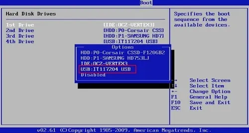
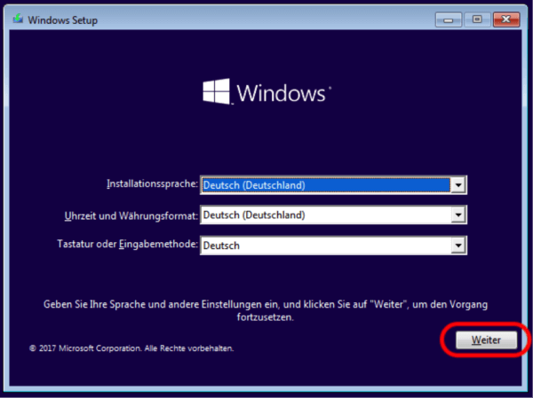

1. ## Download ISO Windows 10

   ``https://massgrave.dev/windows_10_links``
2. ## Siapkan Flasdisk Bootable (16GB)

   ``https://www.wikihow.com/Use-Rufus``
3. ## Masukkan USB Bootable dan masuk boot menu

   - Restart komputer dan masuk ke Boot Menu (biasanya tekan F12, Esc, F2, atau Del, tergantung merek laptop/PC).
4. ## Pilih USB sebagai Perangkat Booting
   
5. ## Mulai Proses Instalasi

   - Muncul layar Windows Setup, pilih:
   - Language to install → Bahasa Indonesia (opsional)

     
   - Time and currency format → Indonesia
   - Keyboard → US
     Klik Next, lalu Install Now.
6. ## Masukkan Product Key (jika ada)

   - Jika diminta, masukkan product key. Bisa juga klik “I don’t have a product key” jika ingin aktivasi nanti.
7. ## Pilih Edisi Windows (jika diminta)

   - Pilih edisi sesuai lisensi kamu, misalnya: Windows 10 Home atau Pro.
8. ## Setujui Lisensi

   - Centang “I accept the license terms”, klik Next.
   - Jika tidak ada pilih "I dont have..."
9.  ## Pilih Jenis Instalasi

   - Pilih Custom: Install Windows only (advanced).
10. ## Atur Partisi Harddisk

    - Hapus partisi lama (jika ingin instal bersih), lalu pilih partisi kosong atau buat baru.
    - Pilih partisi tempat Windows akan diinstal, lalu klik Next.
11. ## Proses Instalasi Berlangsung

    - Windows akan mulai menyalin file dan menginstal sistem. Proses ini bisa memakan waktu 10–30 menit.

Komputer akan restart beberapa kali.
