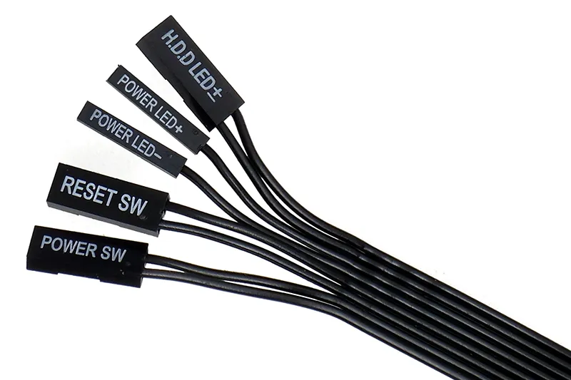

# Langkah-langkah Merakit Komputer

Berikut ini adalah panduan lengkap merakit komputer secara runtut dan benar:

## 1. Persiapkan Komponen-Komponen Utama

Pastikan kamu sudah memiliki semua komponen penting berikut:

- Motherboard

- Prosesor (CPU)

- RAM

- Storage (SSD atau HDD)

- Power Supply (PSU)

- Casing

- VGA/Graphics Card (jika tidak menggunakan iGPU)

- Pendingin CPU (cooler)

- Monitor, keyboard, dan mouse (untuk pengujian)

Jangan lupa juga siapkan obeng plus, permukaan kerja bersih, dan lampu penerangan cukup.

## 2. Pasang Prosesor ke Motherboard

Buka tuas socket prosesor pada motherboard. Sesuaikan tanda segitiga kecil pada prosesor dan socket. Letakkan prosesor dengan hati-hati tanpa tekanan berlebih. Tutup kembali tuas pengunci.

_Source: PCSTATS_

> [!info] Catatan:
>
> Jangan menyentuh bagian bawah prosesor (pin) untuk menghindari kerusakan.

## 3. Pasang Pendingin CPU (Cooler)

Jika menggunakan cooler bawaan, pastikan thermal paste sudah tersedia. Kalau tidak, aplikasikan tipis-tipis di atas CPU. Letakkan cooler sesuai arah lubang pengunci. Kunci keempat sudut dan hubungkan kabel fan ke header CPU_FAN di motherboard.

## 4. Pasang RAM

Buka kait slot RAM di motherboard. Sesuaikan posisi lekukan RAM dengan slot. Tekan hingga bunyi "klik", pastikan terkunci dengan baik.

> [!info] Catatan:
>
> Jangan sentuh konektor berwarna kuning (dibawah)!

## 5. Pasang Motherboard ke Casing

Pasang terlebih dahulu I/O Shield (penutup port belakang) di casing.
Letakkan motherboard di casing, sejajarkan lubang baut dengan dudukan (stand-off). Kencangkan motherboard dengan baut secukupnya (jangan terlalu kencang).

## 6. Pasang Storage (SSD/HDD)

Untuk SSD M.2: Pasang langsung ke slot M.2 pada motherboard, kunci dengan baut kecil.

Untuk SSD/HDD SATA: Pasang ke tempat drive di casing, kunci dengan baut, lalu hubungkan kabel SATA ke motherboard dan power dari PSU.

## 7. Pasang Power Supply (PSU)

Letakkan PSU di tempat yang disediakan (biasanya di bagian bawah casing). Kencangkan dengan baut. Hubungkan kabel daya utama ke motherboard:

- 24-pin ATX (utama)

- 8-pin CPU (biasanya di atas motherboard)

- Konektor sata (jika pakai)

- Konektor Molex (jika pakai)

## 8. Pasang VGA Card (jika ada)

Buka bracket belakang casing sesuai ukuran VGA. Pasang VGA ke slot PCIe x16 di motherboard. Kunci dengan baut danhubungkan kabel daya PCIe dari PSU (jika diperlukan).

> [!info] Catatan:
>
> Jangan sentuh konektor berwarna kuning (dibawah)!

## 9. Hubungkan Kabel Panel Depan dan Fan

Gunakan manual motherboard untuk mengetahui posisi pin dengan tepat.

Hubungkan fan casing ke header FAN atau langsung ke PSU.

## 10. Cek Ulang dan Uji Coba

Periksa ulang semua kabel dan komponen. Sambungkan monitor, keyboard, dan mouse.

Nyalakan PC, masuk ke BIOS (biasanya tekan DEL atau F2). Pastikan semua komponen terdeteksi. Jika tidak ada masalah, lanjutkan dengan instalasi sistem operasi.
